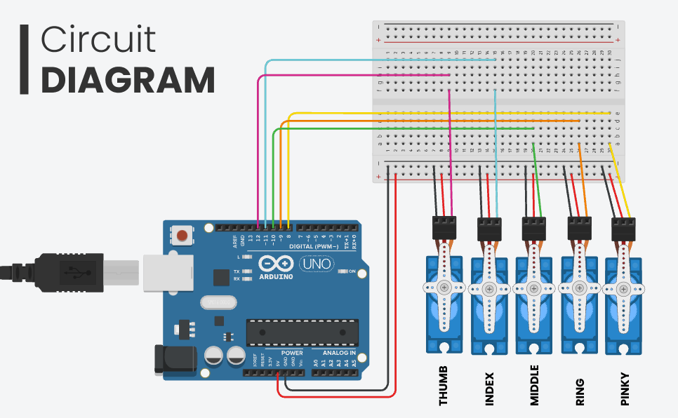

# Hand Gesture Mimicking Robot

This project implements a robotic hand that mimics human hand gestures in real-time using computer vision and microcontroller technology.

## Description

The Hand Gesture Mimicking Robot uses a camera to track a user's hand movements, processes this data to extract fingertip positions, and then controls a set of servos to replicate these movements on a robotic hand. This creates an interactive, real-time mimicking effect.

## Key Features

- Real-time hand tracking using computer vision
- Fingertip position extraction
- Serial communication between computer and microcontroller
- Servo motor control for robotic hand movement
- Mimicking of hand gestures

## Technologies Used

- Python
- MediaPipe (for hand tracking)
- Arduino
- Servo motors (5x)

## Hardware Requirements

- Webcam or camera for hand tracking
- Arduino board (e.g., Arduino Uno)
- 5 servo motors
- Robotic hand frame (3D printed or pre-built)
- Connecting wires

## Software Requirements

- Python 3.7+
- OpenCV library
- MediaPipe library
- PySerial library
- Arduino IDE

## Circuit Diagram

Below is the circuit diagram for connecting the Arduino and servo motors:



## Installation

1. Clone this repository:
   ```
   git clone https://github.com/yourusername/hand-mimicking-robot.git
   ```

2. Install required Python libraries:
   ```
   pip install mediapipe pyserial
   ```

3. Upload the Arduino sketch to your Arduino board using the Arduino IDE.

4. Connect the servos to your Arduino board according to the circuit diagram provided above.

## Usage

1. Connect your Arduino board to your computer.

2. Run the Python script:
   ```
   python hand_tracking.py
   ```

3. Position your hand in front of the camera.

4. Make various hand gestures and watch the robotic hand mimic your movements!

## Configuration

You may need to adjust the following:

- Serial port in the Python script to match your Arduino's port
- Servo pin assignments in the Arduino sketch
- Calibration values for servo movements

## Contributing

Contributions to improve the project are welcome. Please follow these steps:

1. Fork the repository
2. Create a new branch
3. Make your changes and commit them
4. Push to your fork and submit a pull request

## License

This project is licensed under the MIT License - see the [LICENSE.md](LICENSE.md) file for details.

## Acknowledgments

- MediaPipe team for their hand tracking solution
- Arduino community for their extensive libraries and support
